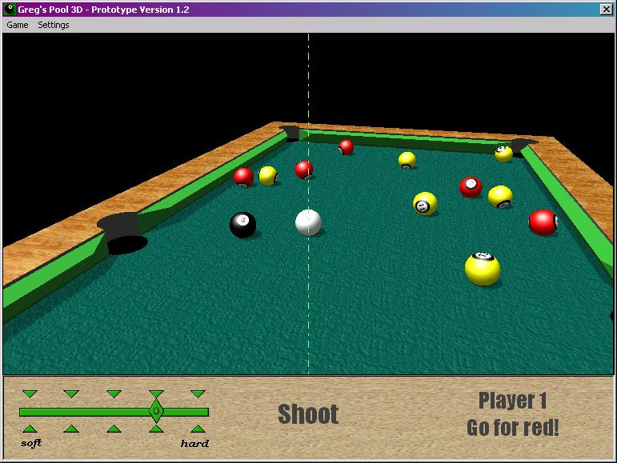



## Greg's Pool 3D Version 1\.2

### Description

Third version of "Greg's Pool 3D". New features include better playability with basic European rules for eight-ball pool and some bug-fixes. For those of You, who have not seen the previous versions, I include the original description:

"The programme is an example of a relatively simple game written in Visual Basic 5.0 with Direct3D, DirectSound, some physics and a handful of mathematics. It uses DirectX 8.0, thus appropriate libraries must be installed on Your computer in order to run the code. Techniques used in this project include: collision detection and response, matrix transformations, linear interpolations, vertex and index buffers, textured meshes, shadows, lighting and few more…"
 
### More Info
 

             |
---                |---
**Submitted On**   |2002-08-10 19:59:30
**By**             |[gerg](https://github.com/Planet-Source-Code/PSCIndex/blob/master/ByAuthor/gerg.md)
**Level**          |Intermediate
**User Rating**    |5.0 (808 globes from 163 users)
**Compatibility**  |VB 5\.0, VB 6\.0
**Category**       |[Games](https://github.com/Planet-Source-Code/PSCIndex/blob/master/ByCategory/games__1-38.md)
**World**          |[Visual Basic](https://github.com/Planet-Source-Code/PSCIndex/blob/master/ByWorld/visual-basic.md)
**Archive File**   |[Greg's\_Poo1167908112002\.zip](https://github.com/Planet-Source-Code/gerg-greg-s-pool-3d-version-1-2__1-37583/archive/master.zip)

